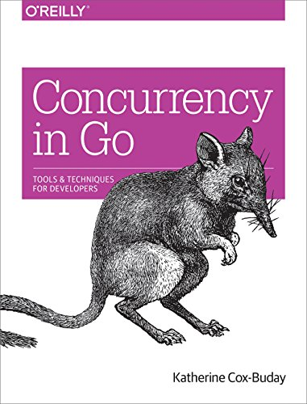

### High-performance concurrency

syossan27

---

### Concurrency is ... ?

---

#### Rob Pike says


---

***But when people hear the word concurrency they often think of parallelism, a related but quite distinct concept.***   
***In programming, concurrency is the composition of independently executing processes, while parallelism is the simultaneous execution of (possibly related) computations.***   
***Concurrency is about dealing with lots of things at once.***   
***Parallelism is about doing lots of things at once.***   

---

***Concurrencyという単語を聞くと、しばしばParallelismのことを考えるかもしれないが、関連こそすれ全く別の概念である。***   
***プログラミングでは、Concurrencyは「独立して実行されるプロセスによる構成」のことですが、Parallelismは「（おそらく関連する）処理の同時実行」のことです。***   
***つまりConcurrencyは、「一度に多くのことを扱うこと」***   
***Parallelismは「一度にたくさんのことをすること」 ***

---?image=assets/images/concurrency_parallelism1.png&size=auto 70%

---?image=assets/images/concurrency_parallelism2.png&size=auto 70%

---

### Simple Concurrency

---

```
for i := 0; i < 10; i++ {
  go func() {
    fmt.Println("Hello")
  }()
}
```

---

This code is NOOP😩

---

### True Simple Concurrency

---

```
var wg sync.WaitGroup
for i := 0; i < 10; i++ {
    wg.Add(1)
    go func() {
        fmt.Println("Hello")
        wg.Done()
    }()
}
wg.Wait()
```

---

```
Hello
Hello
Hello
Hello
Hello
Hello
Hello
Hello
Hello
Hello
```

---

### It's Concurrency👌

---

### High-performance Concurrency is ... ?

---

### Find mistake👀

---

```
type value struct {
    mu    sync.Mutex
    value int
}

var wg sync.WaitGroup
printSum := func(v1, v2 *value) {
    defer wg.Done()

    v1.mu.Lock()
    defer v1.mu.Unlock()

    time.Sleep(2 * time.Second)

    v2.mu.Lock()
    defer v2.mu.Unlock()

    fmt.Printf("sum=%v\n", v1.value+v2.value)
}

var a, b value
wg.Add(2)
go printSum(&a, &b)
go printSum(&b, &a)
wg.Wait()
```
@[7-19](２値をロックしてから、足し算した結果を表示する)
@[23-24](goroutineで２回動かしてみる)

---

```
fatal error: all goroutines are asleep - deadlock!
```

---

Why?🤔

---

### Coffman Conditions

- Mutual Exclusion: リソースは最大１つまでのプロセスにしか確保されないこと
- Wait For Condition:  リソースが確保済みの場合、要求している他のプロセスは待たなければならない
- No Preemption: リソースは確保したプロセスによってのみ解放される
- Circular Wait: リソースを確保しているプロセスAが、他のリソースを確保しているプロセスBのリソースを要求することにより循環待ちが発生する

これを全て満たすとDeadLockを引き起こす

---

```
type value struct {
    mu    sync.Mutex
    value int
}

var wg sync.WaitGroup
printSum := func(v1, v2 *value) {
    defer wg.Done()

    v1.mu.Lock()
    defer v1.mu.Unlock()

    time.Sleep(2 * time.Second)

    v2.mu.Lock()
    defer v2.mu.Unlock()

    fmt.Printf("sum=%v\n", v1.value+v2.value)
}

var a, b value
wg.Add(2)
go printSum(&a, &b)
go printSum(&b, &a)
wg.Wait()
```
@[10,15](Matual Exclusion)
@[10,15](Wait for Condition)
@[11,16](No Preemption)
@[23-24](Circular Wait)

---

### Other

- LiveLock
- Resource Starvation
- MemoryLeak
- etc...

Concurrencyでは考慮しなければならないことが多い👿

---

### High-performance Concurrency is ... Safety💪 

---

### Basic Concurrency Pattern

- Confinement
- Preventing Goroutine Leaks
- Heartbeats

---

### Confinement

---

### Confinement

goroutine内で使うデータに制限をかける手法   
開発者の認知負荷の軽減や、小さなクリティカルセクションに対して効果がある

---

### Type

- ad hoc
- lexical

---

### adhoc

チーム内での認識合意のみで実現する

---

```
data := []int{1, 2, 3, 4}

loopData := func(handleData chan<- int) {
    defer close(handleData)
    for i := range data {
        handleData <- data[i]
    }
}

handleData := make(chan int)
go loopData(handleData)

for num := range handleData {
    fmt.Println(num)
}
```
@[1](mainからもloopDataからも参照出来てしまう)

---

### 🙅

認識のみで縛る方法なので、非常に危険

---

### lexical

レキシカルスコープを利用して、変数へのアクセスを制限する

---

```
loopData := func(handleData chan<- int) {
    defer close(handleData)
    data := []int{1, 2, 3, 4}
    for i := range data {
        handleData <- data[i]
    }
}

handleData := make(chan int)
go loopData(handleData)
for num := range handleData {
    fmt.Println(num)
}
```
@[3](データの参照範囲を明確にする)

---

### 🙆

クリティカルセクションも無くなり、認知負荷が軽減

---

### Preventing Goroutine Leaks

goroutineがGCで解放されないパターンに対応する

---

### Paths to termination

1. 処理の終了
1. 回復不能なエラーの発生
1. 処理の停止

1, 2はGCが動くが、3は動かない

---

### Leak Pattern

---

```
doWork := func(strings <-chan string) <-chan interface{} {
    completed := make(chan interface{})
    go func() {
        defer close(completed)
        for s := range strings { fmt.Println(s) }
    }()
    return completed
}
doWork(nil)
time.Sleep(5 * time.Second)
fmt.Println("Done.")
```
@[12](nil channelは読み込みも書き込みもブロッキングされる)

---

### If long lifecycle application...😥

---

### Implement parent goroutine manage child goroutine👪

---

```
doWork := func(
  done <-chan interface{},
  strings <-chan string,
) <-chan interface{} {
    completed := make(chan interface{})
    go func() {
        defer close(completed)
        for {
            select {
            case s := <-strings: fmt.Println(s)
            case <-done: return
            }
        }
    }()
    return completed
}

done := make(chan interface{})
completed := doWork(done, nil)

go func() {
    time.Sleep(1 * time.Second)
    fmt.Println("Canceling doWork goroutine...")
    close(done)
}()

<-completed
fmt.Println("Done.")
```
@[2](処理の終了を知らせるchannel)
@[21-25](mainから子goroutineへ処理の終了を伝える)
@[11](処理が正常に終了)

---

### Digression

GoのGCではgoroutineでヒープ領域に確保したメモリをOSに返さず、新しく生成されるgoroutineのために再利用しようとする性質があります。   
そのため、 `pprof` や `runtime.MemStats` で確認した時に単純にメモリ使用量が減らないからメモリリークしている、という勘違いをしないよう注意しましょう。   
真に確認するには `pprof` のスタックダンプや、 `leaktest` などのツールを使ったりするのが良いでしょう。

---

### Heartbeats
goroutineの生死を確認する

---

### ２種類の手法

- 周期的なHeartbeats
- タスク毎のHeartbeats

---

### 周期的なHeartbeats 

---

### 手順

- heartbeat channelを用意し、定期的にpulseを送る
- pulseが受け取れなくなったらgoroutineの心の臓が止まったとみなす

---

### 登場人物

---

- main関数
- doWork関数
- work関数
- sendPulse関数

---

### doWork関数

```
func doWork(
	done <-chan interface{},
	pulseInterval time.Duration, 
) (<-chan interface{}, <-chan time.Time) {
	heartbeat := make(chan interface{})
	results := make(chan time.Time)
	go work(heartbeat, results, pulseInterval, done)
	return heartbeat, results
}
```
@[3](heartbeatの確認パルスを送る時間間隔を指定)
@[5](heartbeat channelの作成)
@[7](何かしらの処理をgoroutineで実行)
@[8](main関数でchannelを待てるようにheartbeat channelを返す)

---

### work関数

```
func work(
	heartbeat chan interface{},
	results chan time.Time,
	pulseInterval time.Duration,
	done <-chan interface{},
) {
	defer close(heartbeat)
	defer close(results)

	pulse := time.Tick(pulseInterval)
	workGen := time.Tick(2 * pulseInterval)

	for {
		select {
		case <-done:
			return
		case <-pulse:
			sendPulse(heartbeat)
		case r := <-workGen:
			sendResult(r, done, pulse, heartbeat, results)
		}
	}
}
```
@[10](確認パルスを送るchannelを作成)
@[17-18](時間間隔ごとにsendPulseを動かし確認パルスを送る)
@[7](work関数が死ぬ時にheartbeat channelも閉じる)

---

### sendPulse関数

```
func sendPulse(heartbeat chan interface{}) {
	select {
	case heartbeat <- struct{}{}:
	default:
	}
}
```
@[3](heartbeat channelに値を入れる)
@[4](heartbeat channelのバッファが満杯の時にblockingしないよう空defaultを添える)

---

### main関数

```
func main() {
	done := make(chan interface{})
	time.AfterFunc(10*time.Second, func() { close(done) })
	const timeout = 2 * time.Second

	heartbeat, results := doWork(done, timeout/2)
	for {
		select {
		case _, ok := <-heartbeat:
			if ok == false {
				fmt.Println("心臓の鼓動が停止しました・・・")
				return
			}
			fmt.Println("pulse")
		case r, ok := <-results:
			if ok == false {
				return
			}
			fmt.Printf("results %v\n", r.Second())
		case <-time.After(timeout):
			fmt.Println("タイムアウトしました！")
			return
		}
	}
}
```
@[6](doWork関数を動かしてheartbeat channelを得る)
@[9](heartbeat channelから値を受け取り、心音を確認する)
@[10-13](closeされたらokにfalseが入るので、そこで生死を判断する)

---

### タスク毎のHeartbeats

---

### 手順、登場人物はほぼ一緒

---

### doWork関数

```
func doWork(done <-chan interface{}) (<-chan interface{}, <-chan int) {
  heartbeatStream := make(chan interface{}, 1)
  workStream := make(chan int)
  go work(heartbeatStream, workStream, done)
  return heartbeatStream, workStream
}
```
@[2](heartbeat channelの作成、sendPulseが遅延した場合を考慮しbufferを持たせる)
@[4](何かしらの処理をgoroutineで実行)
@[5](main関数でchannelを待てるようにheartbeat channelを返す)

---

### work関数

```
func work(
	heartbeatStream chan interface{},
	workStream chan int,
	done <-chan interface{},
) {
	defer close(heartbeatStream)
	defer close(workStream)

	for i := 0; i < 10; i++ {
		sendPulse(heartbeatStream)

		select {
		case <-done:
			return
		case workStream <- rand.Intn(10):
		}
	}
}
```
@[9-17](10個分のタスクを実行)
@[10](タスクごとにsendPulseを動かし確認パルスを送る)
@[15](処理結果をworkStreamに送る)

---

### sendPulse関数

一緒

---

### main関数

```
func main() {
	done := make(chan interface{})
	defer close(done)

	heartbeat, results := doWork(done)
	for {
		select {
		case _, ok := <-heartbeat:
			if ok == false {
				fmt.Println("心臓の鼓動が停止しました・・・")
				return
			}
			fmt.Println("pulse")
		case r, ok := <-results:
			if ok {
				fmt.Printf("results %v\n", r)
			} else {
				return
			}
		}
	}
}
```
@[5](doWork関数を動かしてheartbeat channelを得る)
@[8](heartbeat channelから値を受け取り、心音を確認する)
@[9](closeされたらokにfalseが入るので、そこで生死を判断する)

---

### 使い分け

- 周期的なHeartbeats：イベント駆動で処理を開始するような待機型の並行処理に有効
- タスク毎のHeartbeats：goroutineが処理を開始したことだけ確認したい場合に有効

--- 

### 正直これだけだと使い物にならなくない？

その通り。goroutineを蘇生させたりするのに使ったりすることで輝きます。   
大事なのは「子goroutineの状態を親が知る術がある」ということ。

---

### まだまだ大事な話は沢山ある

---

- Replicate Request
- Rate Limit
- Healing Unhealthy Goroutines
- Pipeline
- Error Propagation
- etc...etc...

---

### この先はキミの目で確かめてくれ！

---


